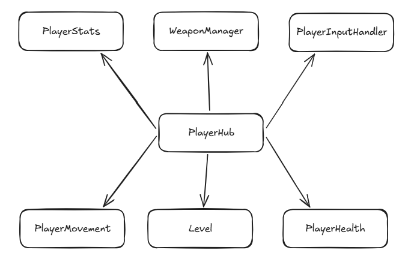

# Way To The Rose [25.10. ~ ]

> Unity 6 기반 2D 뱀서라이크 / 로그라이트 게임 클라이언트 시스템 구현 포트폴리오

 

## 프로젝트 한 줄 소개

`Way To The Rose`는 Unity 6 기반의 2D 뱀서라이크 / 로그라이트 게임으로,  
몰려오는 적을 처치하며 아이템을 얻고 성장하여 보스를 처치하는 것이 목표인 게임입니다.

 

## 프로젝트 개요

| 항목 | 내용 |
|---|---|
| 프로젝트명 | Way To The Rose |
| 장르 | Unity 2D 뱀서라이크 / 로그라이트 |
| 개발 기간 | 2025.10. ~ |
| 개발 인원 | 기획 1명, 개발 2명, 아트 2명, 사운드 1명 |
| 담당 역할 | 게임 클라이언트 / 시스템 구현 |
| 엔진 | Unity 6 |
| 플랫폼 | PC |

---
 

## 기술 스택

| 분류 | 기술 |
|---|---|
| Engine | Unity 6 |
| Language | C# |
| Version Control | Git, GitHub |
| 협업 툴 | Notion, Discord |

---

## 담당 기능

- [플레이어 시스템 구현](#player-system)
- [아이템 시스템 설계 및 구현](#item-system)
- [아이템 획득 및 강화 시스템](#item-growth-system)
- [대화 시스템 구현](#dialogue-system)
- [ScriptableObject 기반 데이터 변환 자동화](#scriptableobject-data-converter)
- [프레임 저하 원인 분석 및 최적화](#performance-optimization)

---

# 세부 내용

## 1. 플레이어 시스템
### Player 구조

`PlayerHub`는 플레이어 관련 주요 컴포넌트를 한 곳에서 참조하는 중심 클래스입니다.  
스킬, 아이템, 체력, 이동, 레벨 시스템이 서로 직접 참조하는 것을 줄이고,  
필요한 컴포넌트는 `PlayerHub`를 통해 접근하도록 구성했습니다.

| 구성 요소 | 역할 |
|---|---|
| `PlayerHub` | 플레이어 관련 주요 컴포넌트 참조를 모아 다른 시스템에서 접근할 수 있도록 관리 |
| `PlayerStats` | 플레이어의 체력, 이동 속도, 공격 관련 스탯 등 런타임 스탯 관리 |
| `WeaponManager` | 플레이어가 보유한 아이템, 스킬, 체인 스킬의 런타임 상태 관리 |
| `PlayerInputHandler` | 플레이어 입력 값을 수집해 상태로 저장하고, 이동 / 공격 등 다른 시스템에서 참조할 수 있도록 관리 |
| `PlayerMovement` | 입력 값을 기반으로 플레이어 이동 처리 |
| `Level` | 플레이어 경험치, 레벨업, 레벨업 이벤트 흐름 관리 |
| `PlayerHealth` | 체력 변경, 재생, 피격 이벤트, 사망 처리 등 플레이어 생존 상태 관리 |

 

---

## 2. 아이템 시스템

아이템 시스템은 ScriptableObject 기반의 정적 데이터와, 플레이 중 변경되는 런타임 상태를 분리하는 방향으로 구현했습니다.

### 주요 구조

| 구성 요소 | 역할 |
|---|---|
| `ItemData` | 아이템의 기본 정보, 최대 레벨, 스킬 / 스탯 보유 여부 관리 |
| `CombinedItemData` | 조합 아이템의 재료 아이템 인덱스 관리 |
| `ItemModuleContainer` | 아이템의 현재 레벨, 액티브 / 패시브 모듈, 성장 데이터를 런타임에서 관리 |
| `ItemActiveModule` | 아이템이 가진 액티브 스킬 실행 정보 관리 |
| `ItemPassiveModule` | 플레이어 스탯에 적용되는 패시브 효과 관리 |
| `MasterDataManager` | 아이템, 스킬, 성장 데이터 조회 관리 |

### 처리 흐름

1. 카드 선택 또는 보상으로 아이템 인덱스를 전달받습니다.
2. `MasterDataManager`에서 해당 `ItemData`를 조회합니다.
3. 처음 획득한 아이템이면 `ItemModuleContainer`를 생성합니다.
4. 이미 보유 중인 아이템이면 현재 레벨을 증가시킵니다.
5. 아이템 데이터에 따라 액티브 / 패시브 모듈을 적용합니다.
6. 아이템 제거 시 패시브 효과와 지속형 스킬을 함께 정리합니다.

### 구현 내용

- ScriptableObject는 원본 데이터로만 사용하고, 플레이 중 변경되는 값은 런타임 객체에서 관리했습니다.
- `ItemModuleContainer`를 통해 아이템의 현재 레벨, 최대 레벨, 액티브 / 패시브 모듈을 관리했습니다.
- 패시브 아이템은 플레이어 스탯에 적용되도록 구성했습니다.
- 액티브 아이템은 스킬 시스템과 연결되어 실행될 수 있도록 구성했습니다.
- 조합 아이템은 일반 아이템과 조건이 다르기 때문에 `CombinedItemData`로 분리했습니다.
- 아이템 제거 시 패시브 효과와 오라 / 궤도형 스킬이 남지 않도록 정리 흐름을 구성했습니다.

### 구현 의도

아이템 시스템은 카드 선택, 스킬 발동, 체인 스킬, 조합 아이템과 모두 연결됩니다.

따라서 단순히 아이템 데이터를 저장하는 구조가 아니라,  
아이템을 획득하고 강화하고 제거하는 과정에서 다른 시스템과 안전하게 연결될 수 있는 구조를 목표로 구현했습니다.

특히 ScriptableObject의 원본 데이터와 런타임 상태를 분리하여,  
플레이 중 레벨 변경이나 모듈 상태 변경이 원본 데이터에 영향을 주지 않도록 구성했습니다.

---

## 3. 카드 선택 시스템

카드 선택 시스템은 레벨업 또는 보상 상황에서 플레이어에게 선택지를 제공하는 기능입니다.

### 주요 구조

| 구성 요소 | 역할 |
|---|---|
| `CardSelectionUI` | 카드 선택 화면 표시 |
| `CardCandidateGenerator` | 현재 상황에 맞는 카드 후보 생성 |
| `CardInfo` | 카드 UI에 표시할 아이템 정보 |
| `ItemCardListType` | 카드 후보 생성 방식 구분 |

### 구현 내용

- 전체 아이템 목록을 기준으로 카드 후보를 생성했습니다.
- 보유 중인 아이템만 후보로 사용하는 경우를 분리했습니다.
- 이미 최대 레벨에 도달한 아이템은 후보에서 제외했습니다.
- 조합 아이템은 일반 아이템과 별도로 조건을 검사했습니다.
- 카드 선택 중 게임 진행을 멈추고, 선택 이후 다시 진행되도록 흐름을 구성했습니다.
- 리롤 / 스킵 버튼을 고려한 카드 선택 UI 흐름을 정리했습니다.

### 후보 생성 기준

카드 후보 생성 시 아래 조건을 함께 고려했습니다.

- 현재 보유 아이템
- 아이템의 현재 레벨
- 아이템의 최대 레벨
- 조합 아이템 여부
- 조합 아이템의 재료 아이템 목록
- 이미 보유한 조합 아이템의 재료 제외 여부
- 카드 후보에서 제외해야 하는 목록

 

---

## 4. 스킬 시스템

스킬 시스템은 다양한 공격 방식을 공통 구조 안에서 실행할 수 있도록 구성했습니다.

### 주요 구조

| 구성 요소 | 역할 |
|---|---|
| `ISkillAction` | 스킬 실행 공통 인터페이스 |
| `CombatStats` | 스킬 실행에 필요한 공통 전투 데이터 |
| `SkillBehavior` | 생성된 스킬 오브젝트의 공통 동작 |
| `ProjectileBehavior` | 투사체형 스킬 동작 |
| `OrbitBehavior` | 궤도형 스킬 동작 |
| `ZoneBehavior` | 범위형 스킬 동작 |

### 구현 내용

- 스킬 실행 로직과 스킬 오브젝트 동작을 분리했습니다.
- 스킬 타입별로 실행 클래스를 나누어 관리했습니다.
- 공통 전투 데이터는 `CombatStats`를 통해 전달했습니다.
- 스킬의 지속 시간, 관통 횟수, 소유자 정보, 체인 스킬 정보를 관리했습니다.
- `objectCount` 값을 활용해 여러 개의 스킬 오브젝트를 생성할 수 있도록 구조를 확장했습니다.
- 방향 기반 발사, 원형 발사, 지정 위치 발사 등 다양한 타겟팅 방식을 고려했습니다.

### 구현한 스킬 유형

- 투사체형 스킬
- 범위형 스킬
- 오라형 스킬
- 궤도형 스킬
- 즉발형 스킬

---

## 5. 오라 / 궤도형 스킬 시스템

오라와 궤도형 스킬은 한 번 생성된 뒤 일정 시간 동안 유지되거나, 조건에 따라 계속 갱신되는 스킬입니다.

### 구현 내용

- 오라형 스킬은 이미 활성화된 오라가 있을 경우 새로 생성하지 않고 지속 시간을 갱신하는 방식을 검토했습니다.
- 궤도형 스킬은 플레이어 주변을 회전하는 오브젝트로 관리했습니다.
- 영구 지속형 또는 긴 지속 시간을 가지는 스킬을 구분해서 처리했습니다.
- 아이템 제거 시 남아있는 오라 / 궤도형 오브젝트를 제거할 수 있도록 구조를 정리했습니다.
- 궤도형 오브젝트가 여러 개일 때 중복 피격 처리 방식을 고려했습니다.

### 구현 의도

오라와 궤도형 스킬은 일반 투사체처럼 생성 후 바로 사라지는 구조가 아닙니다.  
따라서 생성, 갱신, 제거, 중복 피격 처리를 별도로 관리해야 했습니다.

---

## 6. 체인 스킬 시스템

체인 스킬 시스템은 특정 조건이 발생했을 때 다른 스킬을 이어서 발동시키는 구조입니다.

### 체인 발동 조건

| 조건 | 설명 |
|---|---|
| `OnHit` | 적에게 적중했을 때 발동 |
| `OnExpire` | 스킬 지속 시간이 끝났을 때 발동 |
| `OnPenetrationZero` | 관통 횟수가 모두 소모되었을 때 발동 |

### 주요 구조

| 구성 요소 | 역할 |
|---|---|
| `ChainResolveContext` | 체인 스킬 실행에 필요한 위치 및 상태 정보 |
| `ChainSpawnType` | 체인 스킬이 생성될 위치 기준 |
| `ChainSkill` | 체인으로 발동할 스킬 정보 |

### 위치 계산 기준

체인 스킬은 상황에 따라 발동 위치가 달라질 수 있으므로, 위치 계산 기준을 분리했습니다.

예시:

- 시전자 위치
- 최초 스킬 시전 위치
- 마지막 피격 위치
- 특정 위치 기준 가장 가까운 적
- 시전자 기준 가장 가까운 적

### 구현 내용

- 체인 스킬 발동 조건을 스킬 동작과 분리했습니다.
- 체인 스킬 실행에 필요한 정보를 `ChainResolveContext`로 전달했습니다.
- 원본 스킬의 위치, 마지막 피격 위치, 시전자 정보를 활용할 수 있도록 구성했습니다.
- 다양한 스킬 타입에서 공통적으로 체인 스킬을 발동할 수 있도록 구조를 정리했습니다.

---

# Trouble Shooting

## 1. 오라 / 궤도형 스킬 제거 문제

| 구분 | 내용 |
|---|---|
| 문제 | 아이템을 제거해도 오라 또는 궤도형 스킬 오브젝트가 씬에 남아있을 수 있었습니다. |
| 원인 | 지속형 스킬은 한 번 생성된 뒤 별도의 생명주기를 가지기 때문에, 아이템 제거와 스킬 오브젝트 제거가 자동으로 연결되지 않았습니다. |
| 해결 | 아이템 제거 시 해당 아이템이 생성한 지속형 스킬을 추적하고 강제로 제거하는 흐름을 정리했습니다. |
| 결과 | 아이템 제거 후에도 효과가 남아있는 문제를 방지할 수 있게 되었습니다. |

---

## 2. 궤도형 스킬의 중복 피격 처리

| 구분 | 내용 |
|---|---|
| 문제 | 궤도형 오브젝트가 적과 충돌할 때, 같은 대상에게 피격 처리가 여러 번 발생할 수 있었습니다. |
| 원인 | 여러 궤도 오브젝트가 동시에 존재하거나, 같은 오브젝트가 짧은 시간 안에 같은 적과 계속 충돌할 수 있었습니다. |
| 해결 | 충돌 대상의 식별값을 기준으로 중복 피격 여부를 관리하는 방식을 검토했습니다. |
| 결과 | 궤도형 공격의 피격 주기와 중복 처리 기준을 명확히 정리할 수 있었습니다. |

---

# What I Learned

- 아이템, 카드 선택, 스킬, 체인 스킬처럼 서로 연결되는 시스템은 데이터 흐름을 먼저 명확히 잡는 것이 중요하다는 점을 배웠습니다.
- 오라와 궤도형 스킬처럼 지속되는 오브젝트는 생성뿐 아니라 갱신, 제거, 중복 피격 처리까지 함께 설계해야 한다는 점을 배웠습니다.
- 체인 스킬은 발동 조건과 생성 위치를 분리해야 여러 스킬 타입에서 재사용하기 쉽다는 점을 배웠습니다.

---
